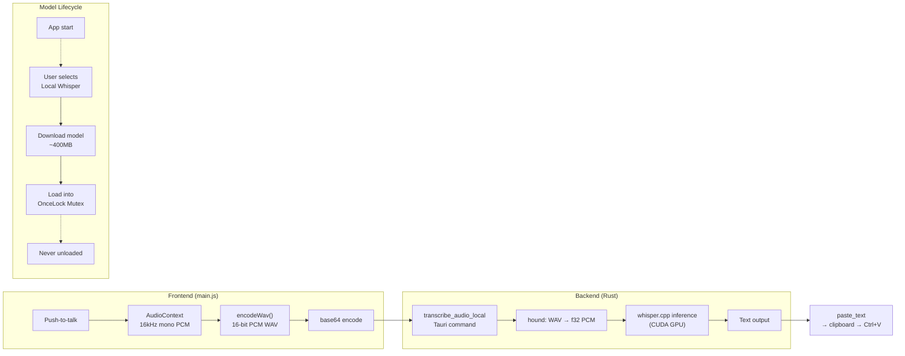

# Local Whisper.cpp Integration — Implementation Summary

## Overview

Local offline transcription added to the Annotate Tauri app using `whisper-rs` v0.16 (Rust bindings for `whisper.cpp`). The model is **loaded once at user request and never unloaded**, enabling sub-second push-to-talk transcription without any cloud dependency.

- **Model**: `ggml-large-v3-turbo-q5_0.bin` (~400MB, downloaded from HuggingFace on first use)
- **GPU Backend**: CUDA with auto-detected architecture + MMQ kernels for quantized inference
- **Dictionary/Initial Prompt**: Same `getDictionaryPrompt()` from the cloud workflow, passed to `FullParams::set_initial_prompt()`

---

## Architecture



---

## Files Changed

### New Files

| File | Purpose |
|------|---------|
| `src-tauri/src/whisper_local.rs` | Core module: model download, loading, WAV→PCM conversion, transcription |
| `src-tauri/.cargo/config.toml` | CUDA build config: auto-detect GPU arch, force MMQ kernels |

### Modified Files

| File | Changes |
|------|---------|
| `src-tauri/Cargo.toml` | Added `whisper-rs` (with `cuda` feature), `hound`, `futures-util`, `tokio`; added `stream` feature to `reqwest` |
| `src-tauri/src/lib.rs` | Added `mod whisper_local`, 5 new Tauri commands, `base64::Engine` import |
| `src/index.html` | Added "Local Whisper (offline)" dropdown option, model status UI with progress bar |
| `src/main.js` | WAV recording via `AudioContext`, model management UI logic, local transcription flow |
| `src/index.css` | Styles for model status, progress bar, action buttons (light + dark mode) |

---

## Tauri Commands

| Command | Signature | Purpose |
|---------|-----------|---------|
| `check_whisper_model` | `() → bool` | Is the model file on disk? |
| `get_whisper_model_path` | `() → String` | File path for UI display |
| `download_whisper_model` | `(app) → ()` | Downloads ~400MB model, emits `whisper-download-progress` events |
| `load_whisper_model` | `() → ()` | Loads model into GPU memory (runs on `spawn_blocking`) |
| `transcribe_audio_local` | `(audio_base64, initial_prompt?) → String` | Full transcription pipeline |

---

## Audio Pipeline

```
Browser mic → AudioContext (16kHz, mono) → ScriptProcessorNode → Float32 buffers
    → encodeWav() (JS: 16-bit PCM WAV with RIFF header)
    → base64 encode → Tauri invoke
    → hound::WavReader (Rust: WAV → f32 PCM)
    → whisper.cpp state.full(params, pcm)
    → segment text extraction → anti-hallucination guard → paste
```

We record as raw PCM via `ScriptProcessorNode` at 16kHz mono, then encode to WAV in JavaScript.
This avoids WebM/Opus entirely — no complex audio decoding needed on the backend.

---

## GPU Acceleration Strategy

### Config (`.cargo/config.toml`)

```toml
[env]
CMAKE_CUDA_ARCHITECTURES = "native"    # Auto-detect GPU at build time
GGML_CUDA_FORCE_MMQ = "ON"             # Use custom quantized kernels
```

### How it works

| Layer | What | Size Impact |
|-------|------|-------------|
| **CUDA kernels** (ggml's own) | Compiled for your GPU only (`native`) | ~5-15MB |
| **MMQ kernels** | Fused dequantize+multiply for Q5_0 | Included in above |
| **cuBLAS** | Dynamically linked from CUDA Toolkit install | 0 (DLLs on your system) |
| **cudart** | CUDA runtime | ~1MB |

**Important**: Requires CUDA Toolkit installed on the build machine. cuBLAS DLLs are loaded at
runtime from your system — they are NOT bundled into the binary.

### Why not cuBLAS-free?

The `whisper-rs-sys` build script hardcodes cuBLAS linkage when `cuda` feature is enabled.
Removing it would require forking the crate. Since you already have CUDA Toolkit installed
and cuBLAS is dynamically linked (not statically bundled), there's no binary bloat.

### Why not a sidecar?

| Concern | Library (current) | Sidecar |
|---------|-------------------|---------|
| Model stays loaded | ✅ `OnceLock` — permanent | ❌ Reloads per invocation |
| Push-to-talk latency | ✅ <1s (function call) | ❌ 5-10s (model reload) |
| Build complexity | ❌ Needs CUDA Toolkit | ✅ Pre-built binaries |
| Binary distribution | ❌ Must compile | ✅ Bundle exe |

**Verdict**: Library linking is required for the "never unload" + instant transcription requirements.

---

## Model Persistence

```rust
// whisper_local.rs
static WHISPER_CTX: OnceLock<Mutex<WhisperContext>> = OnceLock::new();
```

- `OnceLock` — set once, lives for the entire process lifetime
- `Mutex` — thread-safe access for concurrent transcription requests
- `WhisperContext` — holds the loaded model weights in GPU/CPU memory
- **Never dropped** — no unload path exists by design

---

## User Flow

1. **Settings** → Select "Local Whisper (offline)" from Audio Engine dropdown
2. **First time** → "Model not downloaded (~600 MB)" → Click **Download Model**
   - Progress bar shows download progress via `whisper-download-progress` events
3. **After download** → Model auto-loads into memory → "Model loaded & ready" (green)
4. **Subsequent launches** → Select Local Whisper → Click **Load Model** (download skipped)
5. **Push-to-talk** → Same hotkey workflow as cloud mode, transcription runs locally

---

## Anti-Hallucination

Same guard as the cloud (Groq) version:

```rust
let trimmed = text.trim();
if trimmed.is_empty() || trimmed.chars().all(|c| c.is_ascii_punctuation()) {
    return Ok(String::new());  // Suppress hallucinated silence
}
```

---

## Build Requirements

- **CUDA Toolkit** — must be installed and `CUDA_PATH` env var set (for building)
- **CMake** — 3.14+ for whisper.cpp compilation
- **MSVC** — C++ compiler for Windows
- First build with CUDA takes ~10 minutes (compiling whisper.cpp CUDA kernels)

## CUDA Runtime Provisioning (for distribution)

End users do NOT need the full CUDA Toolkit installed. The app auto-provisions CUDA DLLs:

1. **Check** — App looks for `cublas64_12.dll`, `cublasLt64_12.dll`, `cudart64_12.dll` next to the exe
2. **Auto-copy** — If `CUDA_PATH` is set (user has toolkit), DLLs are copied automatically
3. **Download** — If no toolkit, user clicks "Download CUDA Runtime" (~350 MB from NVIDIA's official redistribution CDN)

The DLLs are placed next to the exe — no system-wide installation required.
